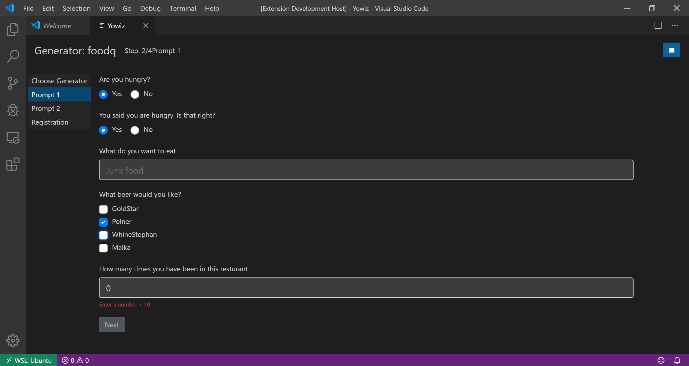

# Yeoman UI



## Description
Provide rich user experience for Yeoman generators using VSCode extension or the browser.
The repository contains three main packages:
* **Frontend** - The Yeoman UI as a standalone vue.js application.
* **Backend** - The backend part which communicate with Yeoman and the system. Runs as a VSCode extension or node.js application.
* **Yeoman example generator** - Example generator to show usages and test the platform.

## Requirements
* [node.js](https://www.npmjs.com/package/node) version 10 or higher.
* [VSCode](https://code.visualstudio.com/) 1.38 or higher or [Theia](https://www.theia-ide.org/) 0.12 or higher.

## Download and Installation
To test run the framework you only need to build & install the backend package, which will automatically build & run the UI.
### installation
* Clone this repository
* cd into the backend folder
    ```bash
    cd backend
    ```
* To install, compile and prepare the static resources run the following commands:
    ```bash
    npm install
    npm run vue:prep
    npm run vue:cp
    ```
### Usage & Development
#### Run the dev mode
Dev mode allows you to run the framework in the browser, using vue cli for fast development cycles, and easy debug tools.
To run it do the following:
* In the backend folder run compile or watch, then run the server.
    ```bash
    npm run watch
    npm run run:ws
    ```
* In the frontend folder run serve
    ```bash
    npm run serve
    ```
* Open the broswer on localhost:8080 to access the framework.

#### Run the VSCode extension
* Start VSCode on your local machine, and click on open workspace. Select this repo folder.
* On the debug panel choose "Run Extension", and click on the "Run" button.

#### Advanced scenarios
To develop and contribute you can build & install each package seperatly. Instruction on each package in the dedicated readme.md file.
* [Build & install the client](frontend/README.md)
* [Build & install the backend](backend/README.md)
* [Build & install the yeoman example generator]()

## Known Issues
* Not all inquirer.js types are supported.
* inquirer.js plugins not supported.
* backend evaluation mid-prompt of functions only support when and validations.

## How to obtain support
To get more help, support and information please open a github issue.

## Contributing
Contributing information can be found in the CONTRIBUTING.md file.

## TODO
* layout
    * move next button to flush with bottom of page
    * navbar (replace?)
* cleanup code
    * remove redundant css
* error handling
    * promise rejects while performing rpc calls
    * ensure callback of `Generator.run()` is called when user aborts during conflict resolution and when exceptions occur.
* provide better handling of timoutes in rpc 
* upload rpc to npm
* support server/extension-side evaluation mid-prompt (e.g. `when()`, `choices` that are functions, etc). See [here](https://github.com/SBoudrias/Inquirer.js/blob/master/README.md#question) for more details on question properties that can be functions
  * Done: `when`, `choices` and `message`
  * Todo: `default`, `validate` (paritaliy done), `filter` and `transformer` (also a choice with `new Separator()`)
* suport for `validate()`
    * support `validate()` for none input type
    * do not show indication when input is valid
* when `when()` returns false, hide instead of disable
* use `debounce` when watching changes to input fields
* support all inquirer question types
  * questions types required by devx in Q4
  * support custom question rendering: generator set the ui renderer, example: tiles instead of dropdown, radio buttons instead of dropdown, etc.
  * support extensible question type custom user interfaces for complex operations (e.g. choose odata source)
  * support inquirer plugins (e.g. date/time)
* support async functions in generator
* provide yeoman generator best practice guide (also provide example)
* provide reference yeoman generator
* support back
* support start over
* enable configuring destination root
* implement ability for yowiz to call methods in vscode extensions
    * support hook for executing commands after finish
    * show ouput in conolse (see separate backlog item)
    * support open workspace in destination
    * support open readme.md file by default (with turn off setting)
* automation
    * CI
    * linter
    * tests
    * build
* make it run in theia
    * ensure styles match vscode themes
* support 3 default themes (vscode-black, vscode-white, non-vscode)
* check gaps when running fiori generator
* align with mockup

## License
Copyright (c) 2019 SAP SE or an SAP affiliate company. All rights reserved. This file is licensed under the Apache Software License, v. 2 except as noted otherwise in the [LICENSE]() file.
