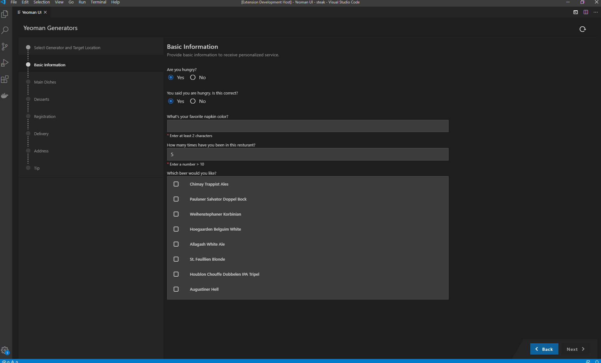

# Application Wizard

## Description

With the Application Wizard extension, you can benefit from a rich user experience for yeoman generators. This extension allows developers to reuse existing yeoman generators and provide wizard-like experience with no development efforts.

This npm [mono-repo][mono-repo] currently contains:

- [VSCode Extension](./packages/backend) The backend part which communicates with Yeoman and the system. It runs as a VSCode extension or node.js application.
- [Application Wizard UI](./packages/frontend) The Application Wizard as a standalone vue.js application.
- [Yeoman generator sample](./packages/generator-foodq) Sample yeoman generator to show usages and test the platform.
- [![npm-yeoman-ui-types][npm-yeoman-ui-types-image]][npm-yeoman-ui-types-url] [@sap-devx/yeoman-ui-types](./packages/types) Type signatures supposed to be used in the yeoman generators.

[npm-yeoman-ui-types-image]: https://img.shields.io/npm/v/@sap-devx/yeoman-ui-types.svg
[npm-yeoman-ui-types-url]: https://www.npmjs.com/package/@sap-devx/yeoman-ui-types

## Support

To get more help, support, and information please open a github [issue](https://github.com/SAP/yeoman-ui/issues).

## Report an Issue

To report an issue please use the github issue tracker. Please try to make sure you have these in your issue:

- No duplicate
- Reproducible
- Good summary
- Well-documented
- Minimal example

## Issue handling process

When an issue is reported, a committer will look at it and either confirm it as a real issue (by giving the "in progress" label), close it if it is not an issue, or ask for more details. In-progress issues are then either assigned to a committer in GitHub, reported in our internal issue handling system, or left open as "contribution welcome" for easy or not urgent fixes.

An issue that is about a real bug is closed as soon as the fix is committed.

## Contributing

See [CONTRIBUTING.md](./CONTRIBUTING.md).

[mono-repo]: https://github.com/babel/babel/blob/master/doc/design/monorepo.md
