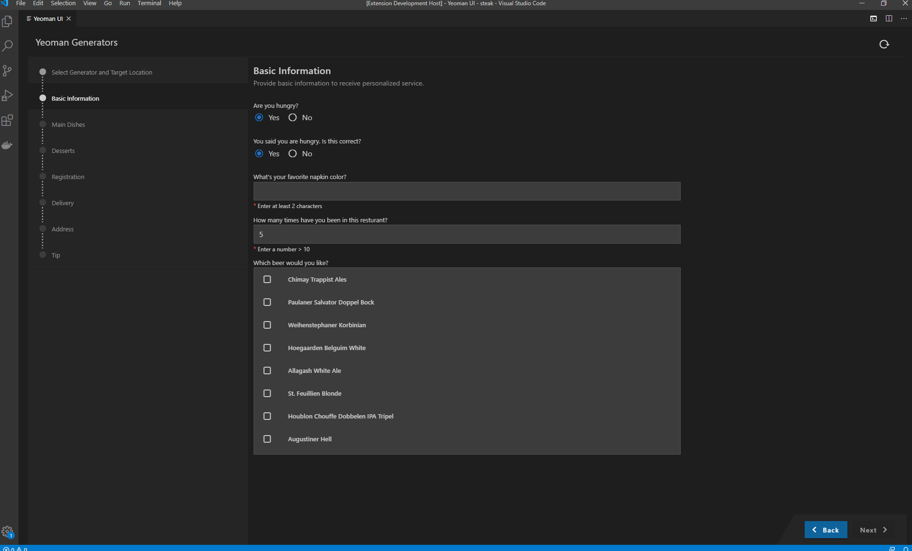

# Application Wizard

With the Application Wizard extension, you can benefit from a rich user experience for Yeoman generators. This extension allows developers to reuse existing Yeoman generators and provide wizard-like experience with no development efforts.

## Requirements

- [node.js](https://www.npmjs.com/package/node) version 10 or higher.
- [VS Code](https://code.visualstudio.com/) 1.39.2 or higher or [Theia](https://www.theia-ide.org/) 0.12 or higher.

## Installation

### From the VS Code Marketplace

In the [Application Wizard](https://marketplace.visualstudio.com/items?itemName=SAPOS.yeoman-ui) VS Code marketplace page, click **Install**.

### From GitHub Releases

1. Go to [GitHub Releases](https://github.com/sap/yeoman-ui/releases).
2. Search for the `.vsix` archive under Assets for the specific release.
3. Follow the instructions for installing an extension from a `.vsix` file in the [VS Code's guide](https://code.visualstudio.com/docs/editor/extension-gallery#_install-from-a-vsix).

## Updates

By default, VS Code auto-updates extensions as new versions become available as explained in https://code.visualstudio.com/docs/supporting/faq#_how-do-i-opt-out-of-vs-code-autoupdates.
If auto-update is disabled in your VS Code, you should update the extension manually to the latest version frequently to avoid supply-chain attack and other cyberattacks.

## Usage

Open VS Code Command Palette and choose "Open Template Wizard" command to open the Wizard.

## Enable usage analytics reporting from VS Code

The tool collects non-personally identifiable information about your usage of the tool to improve its services. If you do not want the tool to collect your usage data, you can set the "Enable Sap Web Analytics" setting to "false". Go to File > Preferences > Settings (macOS: Code > Preferences > Settings) > Extensions > Application Wizard, and deselect the "Enable Sap Web Analytics" checkbox.

## How to obtain support

To get more help, support, and information please open a github [issue](https://github.com/SAP/yeoman-ui/issues).

## Contributing

Contributing information can be found in the [CONTRIBUTING.md](./CONTRIBUTING.md) file.
